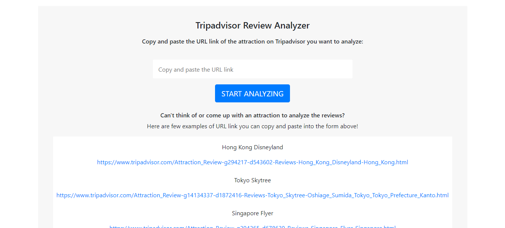
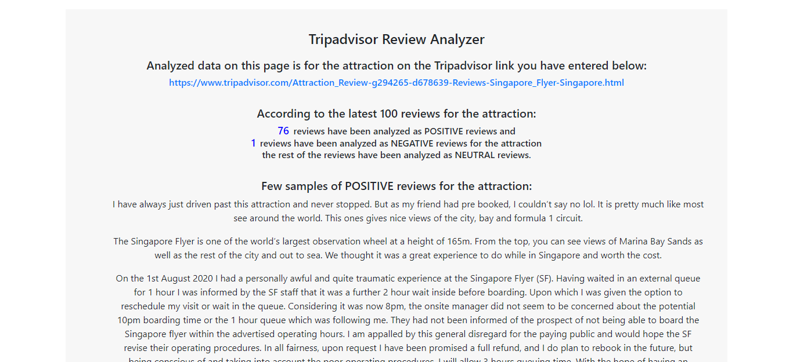

# TripAdvisor Review Analyzer

Tripadvisor Review Analyzer App using <strong>Python</strong> and <strong>selenium</strong> to scrape and extract the latest reviews from an attraction on the Tripadvisor URL link the user enters on the landing page,
scraped review data then cleaned, processed and analyzed with Natural Language Processing toolkit <strong>NLTK</strong> and Sentiment Analysis is performed on the contents of the reviews

## About the Project

Tripadvisor Review Analyzer App for tourist attractions using <strong>Python</strong> and <strong>selenium</strong> to scrape and extract the latest reviews from an attraction on the Tripadvisor URL link the user enters on the app landing page, then the scraped review data are cleaned,processed and analyzed with Natural Language Processing toolkit <strong>NLTK</strong> and Sentiment Analysis is performed on the contents of the reviews.

First of all, when the URL link of an attraction on Tripadvisor is entered by the user,<strong>selenium</strong> will scrape the data for the latest 100 reviews written for the attraction on Tripadvisor page *(less than 100 reviews will be analyzed if the attraction is fairly new or unknown and has less than 100 reviews written on its Tripadvisor page) then, using the Natural Language Toolkit python package <strong>NLTK</strong> and its built-in <strong>Vader Sentiment Analyzer</strong>, classify the reviews written for the attraction as positive, negative or neutral using a lexicon of positive and negative words.

Once the reviews are classified, data processing is performed on positive and negative reviews data
respectively, <strong>Tokenization</strong> to break down the review sentences into meaningful elements as tokens, lowercase texts and remove puctuations then remove the words such as "the",
"is", "what" and so on from the tokenized data that are irrelevant to text sentiment and dont
provide any valuable information which are <strong>stopwords</strong>

The next step is, again with NLTK, get the most common words found in both positive and negative review groups and the following data is available and displayed as analyzed results on the results page:

<strong>number of reviews classified as positive</strong> 
<strong>number of reviews classified as negative</strong> 
<strong>few samples of reviews classified as positive</strong> 
<strong>few samples of reviews classified as negative</strong> 
<strong>Most frequently used words and its frequency found in POSITIVE reviews</strong> 
<strong>Most frequently used words and its frequency found in NEGATIVE reviews</strong> 
<!-- <strong>Top 10 reviewer locations</strong> -->

This is how the results page looks like:

      

